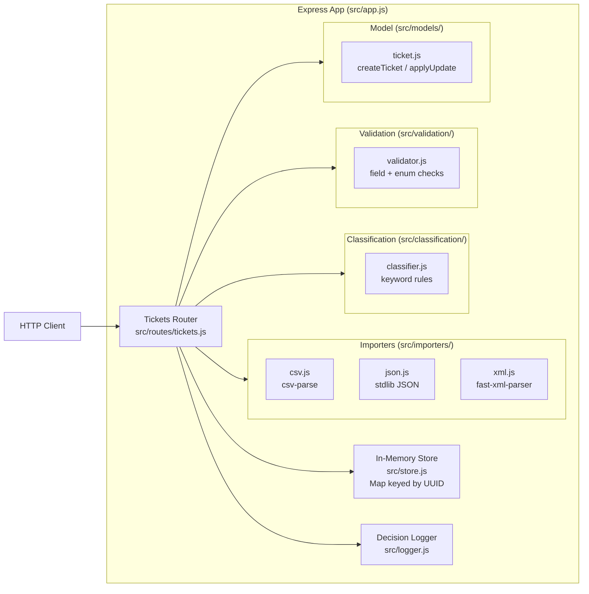

# Homework 2: Intelligent Customer Support System

> **Student Name**: [Your Name]
> **Date Submitted**: [Date]
> **AI Tools Used**: Claude Code (Opus 4.7), with doc generation delegated across Opus/Sonnet/Haiku subagents

---

## Project Overview

A Node.js + Express REST API that manages customer support tickets with multi-format bulk import, rule-based automatic classification, and a comprehensive test suite. All data is held in an in-memory store so no database setup is required.

This submission covers all five tasks from the assignment (`TASKS.md`):

| Task | Feature |
|------|---------|
| Task 1 | Full ticket CRUD + multi-format bulk import (CSV / JSON / XML) |
| Task 2 | Rule-based auto-classification: category, priority, confidence, reasoning, keywords |
| Task 3 | 190 Jest + Supertest tests — 94% statement / 85.6% branch / 90.8% function / 95.2% line coverage |
| Task 4 | Multi-level documentation (README, API Reference, Architecture, Testing Guide) |
| Task 5 | Integration & performance tests including concurrent request benchmarks |

---

## Features

- **Ticket CRUD** — create, read, update, delete with full field validation (UUID ids, email format, string length, closed-set enums)
- **Bulk import** — accepts CSV, JSON, or XML payloads; returns a summary with total / successful / failed-with-per-row-errors
- **Auto-classification** — keyword-driven category and priority detection with confidence score (0–1), reasoning text, and matched keywords
- **Manual override** — `POST /tickets/:id/auto-classify` accepts explicit `category` / `priority` fields to override the rule engine
- **Decision audit log** — every classification event (auto or manual) is logged at runtime
- **Filtered listing** — `GET /tickets` supports filtering by category, priority, status, customer, source, tag, date range, and free-text search, with pagination
- **Liveness probe** — `GET /health` for container / load-balancer readiness checks

---

## Architecture



**Request flow:**
1. A client sends an HTTP request to the Express router.
2. For write operations the request body is validated by `validator.js`.
3. On `POST /tickets/import` the raw text payload is routed to the appropriate format importer (CSV / JSON / XML).
4. On create or `POST /tickets/:id/auto-classify` the `classifier.js` rule engine derives category, priority, confidence, and reasoning from the ticket text.
5. The resulting ticket object is persisted in the in-memory `TicketStore`.
6. Every classification decision is written to the decision audit log via `logger.js`.

---

## Installation & Setup

**Prerequisites:** Node.js 18 or newer, npm 9+.

```bash
# Clone the repository and enter the homework directory
git clone <repo-url>
cd homework-2

# Install dependencies
npm install
```

---

## Running the App

```bash
# Start the server on port 3000
npm start

# Development mode (auto-restart on file changes, Node 18+)
npm run dev
```

The API is available at `http://localhost:3000`. Verify with:

```bash
curl http://localhost:3000/health
# {"status":"ok","service":"customer-support-system"}
```

---

## Running Tests

```bash
# Run the full test suite (190 tests)
npm test

# Run with coverage report
npm test -- --coverage
# Equivalent shorthand:
npm run test:coverage
```

Coverage results (above the 85% gate required by the assignment):

| Metric | Result |
|--------|--------|
| Statements | **94.0%** |
| Branches | **85.6%** |
| Functions | **90.8%** |
| Lines | **95.2%** |

A screenshot of the coverage report is saved at `docs/screenshots/test_coverage.png`.

---

## Project Structure

```
homework-2/
├── src/
│   ├── app.js                     # Express app factory (no listen call)
│   ├── server.js                  # Entry point — calls app.listen on port 3000
│   ├── store.js                   # In-memory TicketStore (Map-backed)
│   ├── logger.js                  # Decision audit log
│   ├── routes/
│   │   └── tickets.js             # All ticket REST endpoints
│   ├── models/
│   │   └── ticket.js              # createTicket / applyUpdate factories
│   ├── classification/
│   │   └── classifier.js          # Keyword-based classify() function
│   ├── importers/
│   │   ├── index.js               # importTickets() dispatcher + detectFormat()
│   │   ├── csv.js                 # csv-parse adapter
│   │   ├── json.js                # stdlib JSON adapter
│   │   ├── xml.js                 # fast-xml-parser adapter
│   │   └── importError.js         # ImportError class (400 errors)
│   ├── validation/
│   │   └── validator.js           # validateTicketInput / validateField
│   └── middleware/
│       └── errorHandler.js        # 404 + global error middleware
├── tests/
│   ├── test_ticket_api.test.js    # API endpoint tests
│   ├── test_ticket_model.test.js  # Data model / validation tests
│   ├── test_import_csv.test.js    # CSV parser tests
│   ├── test_import_json.test.js   # JSON parser tests
│   ├── test_import_xml.test.js    # XML parser tests
│   ├── test_categorization.test.js# Classifier rule tests
│   ├── test_integration.test.js   # End-to-end workflow tests
│   ├── test_performance.test.js   # Concurrent request benchmarks
│   └── fixtures/                  # Sample and invalid data files
│       ├── sample_tickets.csv     # 50 tickets
│       ├── sample_tickets.json    # 20 tickets
│       ├── sample_tickets.xml     # 30 tickets
│       ├── invalid_bad_email.json
│       ├── invalid_missing_fields.csv
│       ├── invalid_enum.xml
│       ├── malformed.json
│       └── malformed.xml
├── docs/
│   ├── API_REFERENCE.md
│   ├── ARCHITECTURE.md
│   ├── TESTING_GUIDE.md
│   └── screenshots/
│       └── test_coverage.png
├── demo/                          # Demo scripts / recordings
├── scripts/
│   └── generate-fixtures.js       # Fixture data generator
├── CLAUDE.md                      # Persistent AI context (see below)
├── TASKS.md                       # Instructor assignment spec (read-only)
├── HOWTORUN.md                    # Concrete run / test commands
├── jest.config.js
└── package.json
```

---

## API Endpoints

| Method | Path | Description |
|--------|------|-------------|
| `GET` | `/health` | Liveness probe |
| `POST` | `/tickets` | Create a ticket (`?autoClassify=true` to auto-classify on creation) |
| `POST` | `/tickets/import` | Bulk import from CSV / JSON / XML |
| `GET` | `/tickets` | List tickets (filterable, paginated) |
| `GET` | `/tickets/:id` | Fetch a single ticket |
| `PUT` | `/tickets/:id` | Update a ticket (partial updates supported) |
| `DELETE` | `/tickets/:id` | Delete a ticket |
| `POST` | `/tickets/:id/auto-classify` | Run auto-classification or apply a manual override |

Full request/response examples and cURL commands are in [docs/API_REFERENCE.md](docs/API_REFERENCE.md).

---

## Documentation

| Document | Audience | Contents |
|----------|----------|---------|
| [docs/API_REFERENCE.md](docs/API_REFERENCE.md) | API consumers | All endpoints, request/response schemas, cURL examples, error formats |
| [docs/ARCHITECTURE.md](docs/ARCHITECTURE.md) | Technical leads | Component descriptions, data flow diagrams, design decisions, security and performance notes |
| [docs/TESTING_GUIDE.md](docs/TESTING_GUIDE.md) | QA engineers | Test pyramid, how to run tests, fixture locations, manual testing checklist, performance benchmarks |
| [HOWTORUN.md](HOWTORUN.md) | Developers | Concrete commands to install, start, and test the application |

---

## AI-Assisted Development

This project was built with **Claude Code** following the **Context-Model-Prompt** framework:

- **Context** — [`CLAUDE.md`](CLAUDE.md) is the persistent context file auto-loaded by Claude Code when working inside `homework-2/`. It captures the stack, ticket model constraints, classification rules, and the definition of done so that every AI interaction starts from the same ground truth.
- **Model** — Claude Opus 4.7 drove implementation and test generation; documentation generation was delegated to Sonnet and Haiku subagents via the `.claude/` skills, commands, and agents configuration.
- **Prompt** — Individual tasks were expressed as targeted prompts that referenced the shared context, keeping each interaction focused and reproducible.

The `.claude/` directory holds the skills and agent definitions that enabled multi-model coordination across implementation, testing, and documentation tasks.

---

<div align="center">

*This project was completed as part of the AI-Assisted Development course.*

</div>
