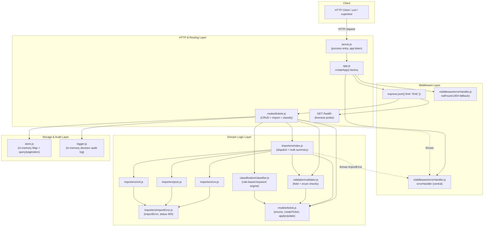
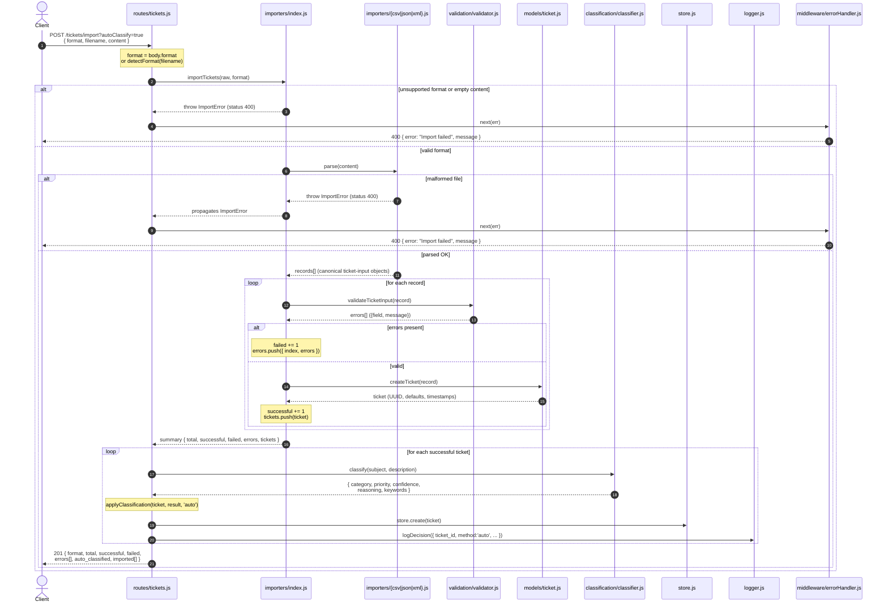

# Architecture — Intelligent Customer Support System

> **Audience:** Technical leads.
> **Scope:** Homework 2 — a Node.js + Express REST API for customer-support
> tickets with multi-format bulk import, rule-based auto-classification, and
> in-memory storage.

---

## 1. Overview

The system is a stateless REST API for managing customer-support tickets. It
exposes CRUD endpoints, a bulk-import endpoint that accepts CSV/JSON/XML, and an
auto-classification endpoint that derives a ticket's `category`, `priority`, and
a `confidence` score from its free text.

The codebase is **CommonJS** JavaScript and follows a strict layered
architecture: HTTP concerns sit at the edge, domain logic (importers,
classification, validation, model) sits in the middle, and an in-memory store
plus a decision logger form the persistence/audit layer. There is no database —
state lives only for the lifetime of the process.

**Key facts**

| Aspect | Value |
|--------|-------|
| Runtime | Node.js, Express |
| Module system | CommonJS |
| Storage | In-memory `Map` (process-lifetime) |
| Classification | Rule-based keyword matching (no ML) |
| Tests | Jest — 190 tests, ~94% coverage |
| Body limit | 5 MB JSON |
| Import formats | CSV, JSON, XML |

---

## 2. High-Level Architecture

The application is organized into four layers. Requests flow inward through
HTTP/routing and middleware, into domain modules, and finally to the storage and
audit layer.

**Layer responsibilities**

- **HTTP & Routing** — owns Express wiring, route definitions, request parsing,
  and HTTP status selection. No business rules live here beyond orchestration.
- **Middleware** — body parsing (with the 5 MB limit), a 404 fallback for
  unmatched routes, and a central error handler that maps thrown errors onto
  clean JSON responses.
- **Domain Logic** — format-specific parsers, the bulk-import orchestrator,
  field/enum validation, the rule-based classifier, and the ticket model
  (enums, defaults, factory, and update helpers). This layer has no knowledge of
  HTTP.
- **Storage & Audit** — a single shared in-memory `TicketStore` and an in-memory
  decision log that records every classification decision.

---

## 3. Request Flow — `POST /tickets/import?autoClassify=true`

Bulk import is the most involved flow in the system. The sequence below traces a
single request from arrival through parsing, per-record validation, ticket
construction, optional classification, storage, audit logging, and the final
summary response.

**Notes on the flow**

- **Format detection** — the route uses `body.format` when present, otherwise
  falls back to `detectFormat(body.filename)`, which inspects the file
  extension. If `body.content` is not a string it is `JSON.stringify`-ed before
  being handed to the importer.
- **Partial success is normal** — invalid records do not abort the import. The
  importer collects `{ index, errors }` entries and still builds tickets for the
  valid rows. The response always returns `201` with a summary; the `failed`
  count and `errors[]` array describe what was rejected.
- **Classification is per-ticket and optional** — it runs only for the
  successfully built tickets, and only when `autoClassify=true` (or
  `auto_classify=true`, or `autoClassify: true` in the body). Each decision is
  written to the audit log.
- **Malformed files fail the whole request** — a parse-level `ImportError`
  (status 400) is thrown before any tickets are built, propagated via
  `next(err)`, and rendered by the central error handler.

---

## 4. Component Descriptions

### Entry & Composition

**`src/server.js`** — Process entry point. Reads `PORT` (default `3000`),
calls `createApp()`, and starts listening. Contains no logic beyond startup.

**`src/app.js`** — The Express **application factory**. `createApp()` builds and
returns a fully configured `app` *without* calling `listen`. It registers the
5 MB JSON body parser, the `/health` liveness probe, the `/tickets` router, and
the `notFound` / `errorHandler` middleware. Returning an un-listened app lets
tests drive it directly with `supertest` and lets every test get a fresh
instance.

### HTTP Layer

**`src/routes/tickets.js`** — All ticket endpoints:

| Method | Path | Purpose |
|--------|------|---------|
| `POST` | `/tickets` | Create one ticket (`?autoClassify=true` optional) |
| `POST` | `/tickets/import` | Bulk import CSV/JSON/XML |
| `GET` | `/tickets` | List with filtering + pagination |
| `GET` | `/tickets/:id` | Fetch one ticket |
| `PUT` | `/tickets/:id` | Update a ticket (partial) |
| `DELETE` | `/tickets/:id` | Delete a ticket |
| `POST` | `/tickets/:id/auto-classify` | Classify, or apply a manual override |

The router orchestrates the domain modules: it validates input, builds/updates
tickets via the model, invokes the classifier and importer, persists to the
store, and logs decisions. It depends on `store`, `models/ticket`,
`validation/validator`, `classification/classifier`, `logger`, and `importers`.
Helpers `applyClassification`, `wantsAutoClassify`, `sendValidationError`, and
`sendNotFound` keep the handlers consistent.

**`src/middleware/errorHandler.js`** — Two functions. `notFound` returns a
`404` for any unmatched route. `errorHandler` is the central handler: it honors
`err.status` / `err.statusCode` (so `ImportError` surfaces as `400`), recognizes
Express's `entity.parse.failed` (malformed JSON body → `400`), defaults to `500`
for anything unexpected, and logs `5xx` errors to `stderr`. It depends on
nothing else.

### Domain Logic Layer

**`src/models/ticket.js`** — The ticket domain model. Declares the closed enum
sets (`CATEGORIES`, `PRIORITIES`, `STATUSES`, `SOURCES`, `DEVICE_TYPES`) and the
string-length bounds for `subject` (1–200) and `description` (10–2000).
`createTicket(input)` produces a fully-formed ticket — a UUID `id`, applied
defaults (`category: 'other'`, `priority: 'medium'`, `status: 'new'`),
`created_at` / `updated_at` timestamps, a normalized `metadata` sub-object, and
`classification: null`. `applyUpdate(ticket, patch)` returns a new object
applying only whitelisted `UPDATABLE_FIELDS`, refreshes `updated_at`, and
stamps/clears `resolved_at` on status transitions to/from `resolved`/`closed`.
It has no dependencies; the validator and the importers depend on it.

**`src/validation/validator.js`** — Field and enum validation. Every validator
returns a list of `{ field, message }` objects — an empty list means valid.
`validateTicketInput(input, { partial })` checks required string fields, enum
fields, the `tags` array, and the optional `metadata` sub-object;
`partial: true` skips required-field checks for absent fields (used by `PUT`).
Email is checked with a pragmatic RFC-5322-ish regex. Depends on
`models/ticket` for the enum sets and length bounds.

**`src/classification/classifier.js`** — The rule-based classification engine.
`classify(subject, description)` lowercases the combined text, scores each
category by keyword-hit count (`scoreCategory`), picks a priority by keyword
precedence `urgent → high → low` with `medium` as the default (`scorePriority`),
maps the category hit-count to a `0–1` confidence (`0.3` floor for no match,
otherwise `min(0.55 + 0.12 * score, 0.97)`), and returns
`{ category, priority, confidence, reasoning, keywords }`. The keyword tables
mirror the assignment spec verbatim. It depends on nothing else.

**`src/importers/index.js`** — The multi-format import dispatcher.
`importTickets(content, format)` validates the format and non-empty content
(throwing `ImportError` otherwise), delegates to the format-specific parser,
then validates every parsed record and builds tickets for the valid ones. It
returns a bulk summary: `{ format, total, successful, failed, errors[],
tickets[] }`. `detectFormat(filename)` guesses the format from a file
extension. Depends on the three parsers, `ImportError`, `validation/validator`,
and `models/ticket`.

**`src/importers/csv.js`** — CSV parser. Uses `csv-parse/sync` with
`columns: true` and `relax_column_count: false` (a column-count mismatch is an
error). Tags are a `;`-separated cell; metadata uses `metadata_*` columns. Empty
optional cells become `undefined` so model defaults apply. Throws `ImportError`
on malformed CSV or a header-only file. Depends on `ImportError`.

**`src/importers/json.js`** — JSON parser. Accepts either a bare array of
tickets or an object of the form `{ "tickets": [...] }`. Throws `ImportError` on
malformed JSON, an empty array, or any other shape. Depends on `ImportError`.

**`src/importers/xml.js`** — XML parser. Uses `fast-xml-parser`; runs
`XMLValidator.validate` first so unclosed/mismatched tags are rejected rather
than silently mis-parsed. Expects `<tickets><ticket>…</ticket></tickets>` with
`<tags><tag>…</tag></tags>` and a nested `<metadata>` element. All values are
kept as strings (`parseTagValue: false`) for predictable validation. Throws
`ImportError` on malformed or wrongly-shaped XML. Depends on `ImportError`.

**`src/importers/importError.js`** — Defines `ImportError`, an `Error` subclass
carrying an HTTP-friendly `status = 400`. This lets parse failures propagate to
the central error handler and become a clean `400` response without crashing
the process. Depends on nothing else.

### Storage & Audit Layer

**`src/store.js`** — The in-memory `TicketStore`, a `Map` keyed by ticket `id`.
Provides `create`, `get`, `update`, `remove`, `all`, `size`, and `clear`, plus
`query(filters)` which supports filtering (category, priority, status,
`customer_id`, `assigned_to`, source, tag, `created_from`/`created_to`,
free-text `search`) and pagination (`page`, `limit` clamped to `1–100`,
default `25`). A single shared `store` instance backs the running app; the
`TicketStore` class is also exported so tests can construct isolated instances.

**`src/logger.js`** — The in-memory decision audit log. `logDecision(entry)`
appends a timestamped record for every classification (`method: 'auto'` or
`'manual'`); `getDecisions(ticketId)` reads the log, optionally filtered to one
ticket; `clear()` resets it for test isolation. Console output is silenced when
`NODE_ENV === 'test'`. Depends on nothing else.

---

## 5. Design Decisions & Trade-offs

### In-memory store (no database)

`TicketStore` is a plain `Map`; state lives for the process lifetime only.

- **Why** — the assignment scope is a self-contained API exercise. A `Map`
  removes all setup friction (no schema, migrations, connection pooling) and
  keeps the test suite fast and deterministic.
- **Trade-off** — no durability, no horizontal scaling, and all data is lost on
  restart. Filtering and pagination are O(n) full scans.
- **Mitigation** — the store is a single cohesive module behind a narrow
  interface (`create`/`get`/`update`/`remove`/`query`). Swapping in a real
  database is a localized change; nothing in the route or domain layers assumes
  an in-memory implementation beyond that interface.

### Rule-based vs ML classification

Classification is keyword matching against fixed tables, not a trained model.

- **Why** — deterministic, fully testable, zero external dependencies or model
  hosting, and instant. Every decision is explainable: the response includes
  `reasoning` and the `keywords` that triggered the match.
- **Trade-off** — no semantic understanding; it misses synonyms, typos, and
  intent not covered by the keyword tables, and confidence is a heuristic
  formula rather than a learned probability.
- **Mitigation** — the closed `confidence` score signals low-confidence
  classifications (`0.3` when nothing matched), and the `POST
  /tickets/:id/auto-classify` endpoint supports a **manual override** so an
  operator can correct any decision. The classifier is isolated behind a single
  `classify()` function, so a future ML implementation can be dropped in without
  touching the routes.

### The app-factory pattern — `createApp()`

`app.js` exports a factory that returns a configured app without calling
`listen`; `server.js` is the only place that listens.

- **Why** — testability. Each test obtains a fresh app and drives it with
  `supertest` in-process — no real port, no teardown races. It cleanly
  separates *application configuration* from *process lifecycle*.
- **Trade-off** — one extra layer of indirection versus a single file.
- **Note** — the shared `store` and the `logger` decision log are
  module-level singletons, so they are *not* reset by creating a new app; tests
  rely on `store.clear()` / `logger.clear()` for isolation.

### `ImportError` with an HTTP status

Parse failures throw `ImportError`, an `Error` subclass carrying `status = 400`.

- **Why** — it lets the domain layer signal "this is a client-input problem"
  without importing Express or knowing about HTTP. The central `errorHandler`
  reads `err.status` and renders the response, keeping the importers
  framework-agnostic.
- **Trade-off** — the domain layer carries a small HTTP detail (a numeric
  status). This is a deliberate, contained concession that keeps the error path
  simple and avoids a parallel error-mapping table.

### Closed-enum validation returning `{ field, message }` lists

Validators never throw and never short-circuit; they return an array of
`{ field, message }` errors (empty = valid).

- **Why** — the client gets *every* problem at once, with a stable,
  machine-readable shape, instead of fixing one error per round-trip. Closed
  enum sets (`category`, `priority`, `status`, `metadata.source`,
  `metadata.device_type`) are validated against the model's authoritative
  arrays, so the error messages always list the exact accepted values.
- **Trade-off** — slightly more verbose than throw-on-first-error.
- **Benefit** — the same validator powers single-create (`POST`), partial
  update (`PUT`, via `{ partial: true }`), and per-record bulk import, which is
  why import can report `{ index, errors }` for every rejected record.

---

## 6. Security & Performance Considerations

Appropriate to the scope of this exercise:

### Input handling

- **Validation at the boundary** — every write path (`POST`, `PUT`, bulk
  import) runs `validateTicketInput` before any ticket is built or stored.
  Enum fields are checked against closed sets, string lengths are bounded
  (`subject` 1–200, `description` 10–2000), and email format is checked. This
  blocks malformed and oversized field values from entering the store.
- **5 MB JSON body limit** — `express.json({ limit: '5mb' })` caps request
  size, bounding memory use and providing basic protection against
  payload-based denial-of-service. Oversized or malformed bodies are rejected by
  Express (`entity.parse.failed`) and rendered as a clean `400` ("Malformed JSON
  body") by the central error handler.
- **Graceful malformed-file handling** — each parser validates structure before
  trusting it: CSV uses `relax_column_count: false`, XML runs
  `XMLValidator.validate` first, JSON catches `JSON.parse` failures. All parse
  failures become an `ImportError` (`400`) with a human-readable message; the
  process never crashes on bad input.
- **Whitelisted updates** — `applyUpdate` copies only `UPDATABLE_FIELDS` from
  the patch, so a client cannot overwrite server-managed fields such as `id`,
  `created_at`, or `classification` through `PUT`.

### Auditability

- **Decision audit log** — `logger.js` records every classification decision
  (auto and manual) with a timestamp, ticket id, method, category, priority,
  confidence, and reasoning. This gives a complete, queryable trail of how each
  ticket was classified — important once a manual override changes an automated
  decision.

### Statelessness & performance

- **Stateless request handling** — no per-client session state; the only shared
  state is the in-memory store and the decision log. Each request is
  self-contained, which keeps reasoning about behavior simple.
- **In-memory performance** — store operations are fast (`Map` get/set are
  effectively O(1)). `query` filtering and free-text `search` are O(n) full
  scans, and pagination slices after filtering; acceptable at the data volumes
  this exercise targets but a known scaling limit. Pagination `limit` is clamped
  to a maximum of `100` to bound response size.
- **Classification cost** — `classify` is pure string matching over fixed
  keyword tables; it runs in-process with no I/O, so bulk import with
  auto-classification stays fast and predictable.

### Known limitations (out of scope for this exercise)

- No authentication or authorization — every endpoint is open.
- No rate limiting beyond the body-size cap.
- No transport security (TLS terminates outside this app).
- No data durability — a restart clears all tickets and the decision log.

These are acceptable given the homework scope but would be the first items to
address before any production use.
