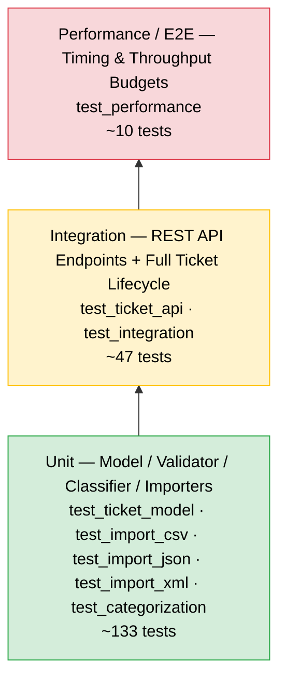

# Testing Guide — Intelligent Customer Support System

Audience: QA Engineers  
Stack: Jest 29 + Supertest, CommonJS (Node.js)  
Total: **190 tests across 8 suites, all passing**

---

## Test Pyramid



---

## Running the Tests

### Run all tests

```bash
npm test
```

### Run all tests with coverage report

```bash
npm test -- --coverage
# or using the dedicated script
npm run test:coverage
```

### Run a single test file

```bash
npx jest tests/test_ticket_api.test.js
npx jest tests/test_performance.test.js
```

### Run tests matching a name pattern

```bash
npx jest --testNamePattern="classify"
```

### Coverage report location

After running with `--coverage`, the HTML report is available at:

```
coverage/lcov-report/index.html
```

Open it in a browser to drill into per-file line/branch coverage.

---

## Coverage Gate

The `jest.config.js` enforces an **85 % minimum** across all four coverage metrics. The suite fails the build if any metric falls below the threshold.

| Metric | Threshold | Actual |
|---|---|---|
| Statements | 85 % | 94.04 % |
| Branches | 85 % | 85.57 % |
| Functions | 85 % | 90.76 % |
| Lines | 85 % | 95.22 % |

---

## Test Suite Reference

| File | Layer | What It Covers | Tests |
|---|---|---|---|
| `test_ticket_model.test.js` | Unit | `createTicket` factory (UUID, timestamps, defaults, tags copy), `applyUpdate` (resolved_at lifecycle, metadata merge), `validateTicketInput` / `validateField` / `validateMetadata` — all field rules including partial mode | 43 |
| `test_categorization.test.js` | Unit + API | `classify()` for all 6 categories and all 4 priority tiers; output shape (confidence range, keywords array, reasoning string); `scoreCategory` / `scorePriority` internals; `POST /:id/auto-classify` manual override via API | 42 |
| `test_import_xml.test.js` | Unit | XML parser for 30-record fixture; single vs multi `<ticket>` elements; `normalizeTags` edge cases (null, empty, single vs array, whitespace trimming); `normalizeTicket` optional-field handling; `invalid_enum.xml` summary; `malformed.xml` `ImportError` | 27 |
| `test_ticket_api.test.js` | Integration | Every REST endpoint via Supertest: `GET /health`, `POST /tickets` (happy path + validation), `GET /tickets` (filters: category / priority / status / source / tag / search, pagination), `GET /:id`, `PUT /:id`, `DELETE /:id`, `POST /:id/auto-classify`, unknown routes | 27 |
| `test_integration.test.js` | E2E | Full create→read→update→resolve→delete lifecycle; classification persistence after update; bulk import of all three formats; `?autoClassify=true` bulk import; 20 concurrent `POST /tickets` (all unique IDs); combined category+priority+status filters; error handler paths (404, malformed JSON body) | 20 |
| `test_import_csv.test.js` | Unit | CSV parser for 50-row fixture (field types, semicolon-delimited tags, metadata columns); `invalid_missing_fields.csv` error summary; `ImportError` on malformed CSV, empty content, header-only file, unsupported format | 11 |
| `test_import_json.test.js` | Unit | JSON parser for 20-record bare array; wrapped `{ tickets: [...] }` shape; `ImportError` for missing `tickets` key, empty array, empty content; `invalid_bad_email.json` validation summary | 10 |
| `test_performance.test.js` | Performance | Bulk import timing (CSV/JSON/XML); `GET /tickets` query latency with 100 tickets (plain, filtered, paginated); `classify()` throughput (1000 calls); consistency of repeated classification; bulk import with `?autoClassify=true` end-to-end timing | 10 |

---

## Fixture Files

All fixtures live under `tests/fixtures/`.

### Valid data fixtures

| File | Format | Records | Purpose |
|---|---|---|---|
| `sample_tickets.csv` | CSV | 50 | Primary bulk-import test data; includes multi-value semicolon-delimited tags and `metadata_*` columns |
| `sample_tickets.json` | JSON | 20 | Bare JSON array; used by import and performance tests |
| `sample_tickets.xml` | XML | 30 | XML document with `<tickets><ticket>…</ticket></tickets>` structure; includes `<tags><tag>` children and `<metadata>` elements |

### Invalid / negative test fixtures

| File | Format | What Is Wrong | Used By |
|---|---|---|---|
| `invalid_missing_fields.csv` | CSV | Rows with required fields (`customer_id`, `customer_email`, `subject`, `description`) left blank | `test_import_csv` — verifies that `failed > 0` and error detail includes `index` + field errors |
| `invalid_bad_email.json` | JSON | 2 records with malformed email addresses and a description shorter than 10 characters | `test_import_json` — expects `failed === 2`, error pointing to `customer_email` field |
| `invalid_enum.xml` | XML | 1 record with an out-of-range `category` value (not in the allowed enum) | `test_import_xml`, `test_integration` — expects `failed > 0` and `errors` array in the summary |
| `malformed.json` | JSON | Syntactically broken JSON (not parseable) | `test_import_json`, `test_integration` — expects `ImportError` / `400` response |
| `malformed.xml` | XML | XML with an unclosed tag, making it unparseable | `test_import_xml`, `test_integration` — expects `ImportError` / `400` response |

---

## Performance Benchmarks

All budgets are deliberately generous so the suite is stable across CI environments. Timings are measured wall-clock with `Date.now()`.

| Scenario | Fixture / Operation | Records | Budget |
|---|---|---|---|
| `importTickets` CSV parse (direct) | `sample_tickets.csv` | 50 | < 2 000 ms |
| `POST /tickets/import` CSV (HTTP round-trip) | `sample_tickets.csv` | 50 | < 3 000 ms |
| `importTickets` JSON parse (direct) | `sample_tickets.json` | 20 | < 500 ms |
| `importTickets` XML parse (direct) | `sample_tickets.xml` | 30 | < 1 000 ms |
| `GET /tickets` list (100 tickets in store) | all three fixtures combined | 100 | < 500 ms |
| `GET /tickets?category=…&priority=…` filtered | all three fixtures combined | 100 | < 500 ms |
| `GET /tickets?limit=10&page=3` paginated | `sample_tickets.csv` | 50 | < 500 ms |
| `classify()` throughput (loop) | 8 rotating subjects | 1 000 calls | < 1 000 ms |
| `classify()` determinism | same subject + description | 10 repeated calls | category / priority / confidence identical across all 10 |
| `POST /tickets/import?autoClassify=true` | `sample_tickets.csv` | 50 | < 3 000 ms |

---

## Manual Testing Checklist

Use this checklist to verify the running application end-to-end before a release.

### Setup

- [ ] `npm start` launches the server on the default port without errors.
- [ ] `GET http://localhost:3000/health` returns `200 { "status": "ok" }`.

### Create a ticket

- [ ] `POST /tickets` with a valid body returns `201` and a UUID `id`.
- [ ] `POST /tickets` with an empty body returns `400` with `error: "Validation failed"` and a `details` array listing missing fields.
- [ ] `POST /tickets` with `customer_email: "not-an-email"` returns `400` with `details[].field === "customer_email"`.
- [ ] `POST /tickets?autoClassify=true` with a billing-related subject returns `201` and a non-null `classification` object with `method: "auto"`.
- [ ] `POST /tickets` without `?autoClassify=true` returns `201` with `classification: null`.

### Retrieve and filter tickets

- [ ] `GET /tickets` returns `200` with `tickets: []` when no tickets exist.
- [ ] After creating tickets with different categories, `GET /tickets?category=bug_report` returns only `bug_report` tickets.
- [ ] `GET /tickets?priority=urgent` returns only `urgent` tickets.
- [ ] `GET /tickets?status=in_progress` returns only `in_progress` tickets.
- [ ] `GET /tickets?source=chat` returns only tickets with `metadata.source === "chat"`.
- [ ] `GET /tickets?tag=vip` returns only tickets that include `"vip"` in their `tags` array.
- [ ] `GET /tickets?search=needle` returns only tickets whose `subject` or `description` contains the search term.
- [ ] `GET /tickets?page=2&limit=2` with 5 tickets returns exactly 2 results and `pagination.page === 2`.

### Retrieve, update, and delete a single ticket

- [ ] `GET /tickets/:id` for a valid ID returns `200` with the ticket object.
- [ ] `GET /tickets/nonexistent` returns `404 { "error": "Not found" }`.
- [ ] `PUT /tickets/:id` with `{ "subject": "Updated" }` returns `200` with the new subject and an updated `updated_at`.
- [ ] `PUT /tickets/:id` with `{ "status": "resolved" }` returns `200` with `resolved_at` set to a non-null ISO string.
- [ ] `PUT /tickets/:id` with `{ "category": "invalid_category" }` returns `400 { "error": "Validation failed" }`.
- [ ] `DELETE /tickets/:id` returns `204`; a subsequent `GET /tickets/:id` returns `404`.
- [ ] `DELETE /tickets/ghost` returns `404`.

### Auto-classification endpoint

- [ ] `POST /tickets/:id/auto-classify` (no body) on a ticket with a clear billing subject returns `200` with `classification.category === "billing_question"` and `confidence > 0`.
- [ ] `POST /tickets/:id/auto-classify` with `{ "category": "feature_request", "priority": "low" }` returns `200` with `method: "manual"`, `classification.confidence === 1`, and the ticket's category and priority updated accordingly.
- [ ] `POST /tickets/:id/auto-classify` with `{ "category": "not_valid" }` returns `400`.
- [ ] `POST /tickets/ghost/auto-classify` returns `404`.

### Bulk import — CSV

- [ ] `POST /tickets/import` with `{ "format": "csv", "content": <sample_tickets.csv> }` returns `201` with `total: 50`, `successful: 50`, `failed: 0`.
- [ ] `POST /tickets/import` with `{ "format": "csv", "content": <invalid_missing_fields.csv> }` returns `201` with `failed > 0` and an `errors` array.

### Bulk import — JSON

- [ ] `POST /tickets/import` with `{ "format": "json", "content": <sample_tickets.json> }` returns `201` with `total: 20`, `successful: 20`, `failed: 0`.
- [ ] `POST /tickets/import` with `{ "format": "json", "content": <malformed.json> }` returns `400`.

### Bulk import — XML

- [ ] `POST /tickets/import` with `{ "format": "xml", "content": <sample_tickets.xml> }` returns `201` with `total: 30`, `successful: 30`, `failed: 0`.
- [ ] `POST /tickets/import` with `{ "format": "xml", "content": <malformed.xml> }` returns `400`.
- [ ] `POST /tickets/import` with `{ "format": "xml", "content": <invalid_enum.xml> }` returns `201` with `failed > 0` and an `errors` array.
- [ ] `POST /tickets/import?autoClassify=true` with the XML fixture returns `201` with `auto_classified: true` and tickets visible in `GET /tickets`.

### Unsupported format

- [ ] `POST /tickets/import` with `{ "format": "xlsx", "content": "…" }` returns `400`.

### Error handling

- [ ] `GET /unknown-path` returns `404 { "error": "Not found" }`.
- [ ] `POST /tickets` with `Content-Type: application/json` and a syntactically broken body returns `400`.
